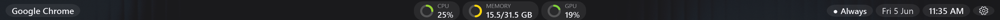

# Lintel

A macOS / Linux-style **top bar for Windows 11** with a fluid, Dynamic Island-style widget system. Lightweight native WPF (.NET 8) — no Electron, tiny runtime footprint. Spans the full width of your screen and holds widgets that animate, reflow, and grow menus straight out of the bar.



## Widgets

The bar is built from widgets arranged into three zones — **left**, **center**, **right**:

- **Active App** — name of the foreground application
- **Clock** / **Date**
- **Mode** — current visibility mode; click to cycle
- **Settings** — gear, opens the settings window
- **Performance gauges** — **CPU**, **Memory**, **GPU**, **Disk**, **Network**, **Battery**, each a colour-coded ring (green → amber → red) that animates as load changes

**Hover any performance gauge** and a card grows out from under it showing a **colour-coded history graph** with live min / avg / max.

### Customize mode

Right-click the bar (or use the tray icon) → **Customize Widgets**:

- A floating **+ button** appears under the bar — click it to **add** any widget
- Each widget gets a **×** badge to remove it
- **Drag** widgets to reorder them; they fluidly slide out of the way
- Drag toward the middle to **snap a widget to the center** zone
- Layout is saved automatically; right-click → *Customize Widgets* again (or the tray) to finish

Submenus, the add picker, and hover graphs all animate by scaling smoothly out of the bar.

## Visibility modes

Lintel has three modes (switch them from the **Lintel menu**, the mode chip on the bar, the tray icon, or Settings):

| Mode | Behaviour |
|------|-----------|
| **Always On** | Bar is always visible and **reserves desktop space** — maximized windows sit *below* it, exactly like the macOS menu bar. |
| **Auto-Hide** | Bar stays hidden. Push the cursor to the **very top edge** of the screen to slide it in; it hides again shortly after the cursor leaves. Reveal/hide timing is configurable. |
| **Dynamic** | Bar floats on top and is visible by default, but **automatically hides** whenever a window is fullscreen or overlaps the strip it occupies — then reappears when the obstruction is gone. |

## Editable settings

Open **Settings** from the `Lintel` menu, the gear icon, or by double-clicking the tray icon. Everything is saved to `%AppData%\Lintel\settings.json`.

- **Visibility mode**
- **Bar height** (px)
- **Auto-Hide timing** — *reveal hold* (how long the cursor must rest at the top before showing), *hide delay* (how long it stays open after the cursor leaves), *trigger zone* (thickness of the top hot-edge)
- **Dynamic timing** — *hide delay* grace period before hiding when covered
- **Animation** duration of the slide in/out (0 = instant)
- **Appearance** — background / text / accent colors (`#AARRGGBB`)
- **Items** — show/hide the active app name, clock, date; 12h vs 24h clock
- **Monitor index** (0 = primary)
- **Launch at Windows startup**

Changes apply live when you click **Apply** or **Save & Close**.

## Running it

A ready-to-run, **self-contained** executable (no .NET install required) is in `publish\`:

```
publish\Lintel.exe
```

A desktop shortcut (`Lintel.lnk`) is created for convenience. Quit anytime from the tray icon → **Quit Lintel**.

## Building from source

Requires the **.NET 8 SDK**.

```powershell
# Debug run
dotnet run --project Lintel.csproj

# Portable self-contained single-file exe
dotnet publish Lintel.csproj -c Release -r win-x64 --self-contained true `
  -p:PublishSingleFile=true -p:IncludeNativeLibrariesForSelfExtract=true `
  -p:EnableCompressionInSingleFile=true -o publish
```

For a much smaller, framework-dependent build (needs the .NET 8 Desktop Runtime installed), drop `--self-contained true` and the single-file flags.

## How it works

- **WPF window** docked to the top edge, `WS_EX_TOOLWINDOW | WS_EX_NOACTIVATE` so it never steals focus or appears in Alt-Tab. When hidden it becomes click-through (`WS_EX_TRANSPARENT`) so it never blocks other apps.
- **Always-On** registers a top-docked **desktop AppBar** (`SHAppBarMessage`) — the same mechanism the taskbar uses to reserve space.
- **Auto-Hide / Dynamic** poll the cursor position and the foreground window (~80 ms) to decide whether to slide the bar in or out.
- **Per-monitor-v2 DPI aware**, so it lines up pixel-perfect on scaled displays.

## Project layout

```
Lintel.csproj          project + build settings
app.manifest           PerMonitorV2 DPI awareness
App.xaml(.cs)          startup, single-instance guard, tray icon
MainWindow.xaml(.cs)   the bar, visibility state machine, customize mode, drag, popups
SettingsWindow.xaml(.cs)
Models/AppSettings.cs  config model + JSON persistence (incl. widget layout)
Interop/               Win32 P/Invoke, AppBar, monitor helpers
Services/              PerfMonitor (CPU/RAM/GPU/…), foreground probe, startup registration
Controls/              RingGauge, HistoryGraph, AnimatedBarPanel (fluid reflow)
Widgets/               WidgetCatalog, WidgetView, IWidgetHost
```
