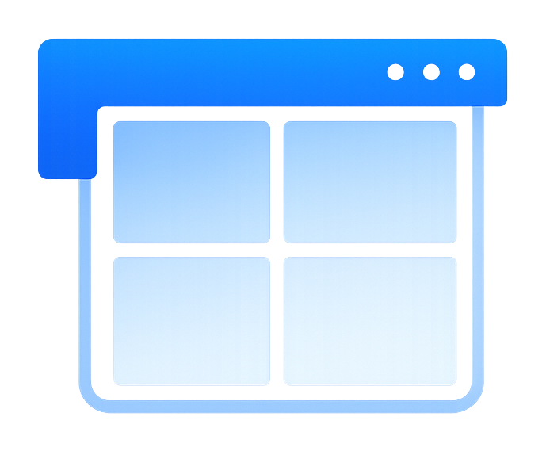
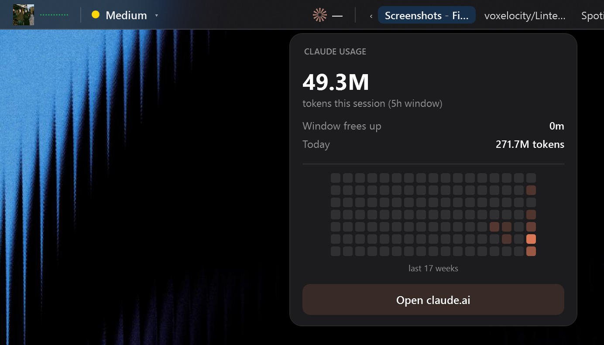
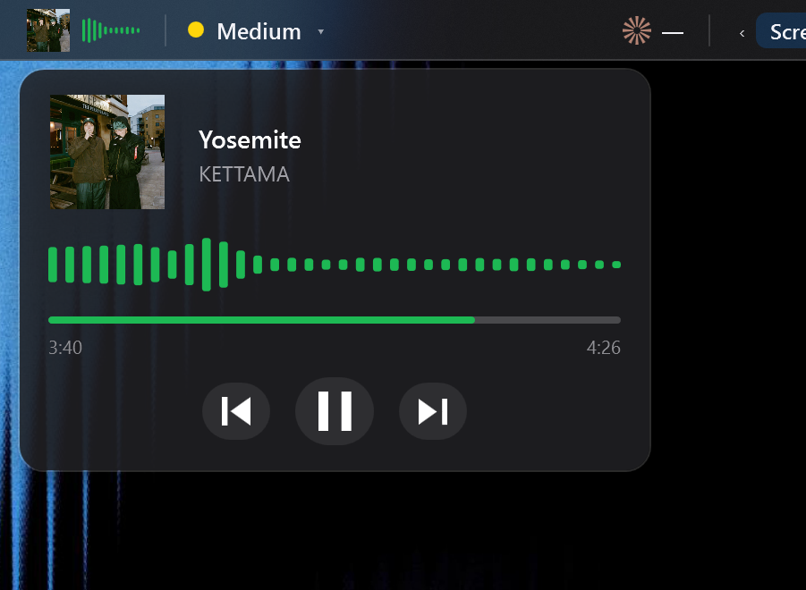
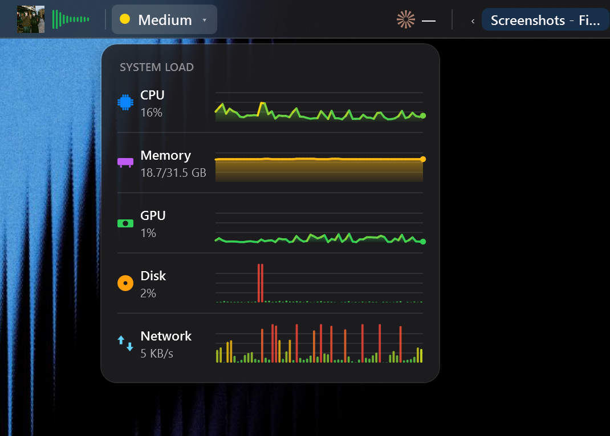

<div align="center">



# Lintel

A macOS / Linux-style **top bar for Windows 11** with a fluid, Dynamic Island-style widget system. Lightweight native WPF (.NET 8) — no Electron, tiny runtime footprint. Spans the full width of your screen and holds widgets that animate, reflow, and grow menus straight out of the bar.

### [⬇️ Download the installer](https://github.com/voxelocity/Lintel/raw/main/installer/LintelSetup.exe)

🔊 **[Listen to the Lintel ad](docs/lintelad.wav)**

</div>


## Install

**[Download `LintelSetup.exe`](https://github.com/voxelocity/Lintel/raw/main/installer/LintelSetup.exe)** and run it — a standard setup wizard installs Lintel per-user (**no administrator rights needed**), adds a Start Menu entry and an optional desktop shortcut, and registers an entry in *Apps & features* so you can uninstall cleanly. Lintel launches right after install; enable **Launch at Windows startup** from Settings if you want it on every login.

> Self-contained — the .NET 8 runtime is bundled, so nothing else needs to be installed.

## Screenshots

| Claude usage | Now playing | System load |
|:---:|:---:|:---:|
|  |  |  |

## Widgets

The bar is built from widgets arranged into three zones — **left**, **center**, **right**. Every widget sits on a uniform, squarish bubble:

- **Active App** — name of the foreground application
- **Clock** / **Date**
- **Mode** — current visibility mode; click to cycle
- **Settings** — gear, opens the settings panel
- **Performance gauges** — **CPU**, **Memory**, **GPU**, **Disk**, **Network**, **Battery**, each with its own **distinct icon** in a signature colour. The **Battery** fills up like macOS and turns amber/red when low.
- **System Load** — one compact widget that summarises overall usage as **Low / Medium / High** (colour-coded). Click it to drop down a panel with **live mini-graphs for every resource**.
- **App Tabs** — your open windows shown as taskbar-style tabs (focused one highlighted, click to switch). A compact mode shows just the focused window with an expand chevron that drops a vertical switcher.
- **Quick Note** — a persistent scratch note; click to edit inline.
- **Workspaces** — two arrow buttons with the **current virtual-desktop name** between them; click an arrow to switch desktops.
- **Media** — now-playing from the Windows media session. Compact shows the cover art + an audio visualizer; click to expand a player with a large cover, title/artist, progress bar, transport controls, and a bigger visualizer.
- **Claude** — reads Claude Code's local usage to show a **token-usage heatmap** (last 17 weeks), your current 5-hour window usage / tokens left, when the window frees up, today's total, and a button that **opens the Claude desktop app** (or claude.ai). Set an optional token budget in Advanced settings.
- **GitHub** — your **contribution graph** plus quick actions: **clone a repo** (`owner/repo` or URL) straight to your Desktop, and **create a new repo from a folder** and push it. Uses the `gh` CLI.

## Themes

Switch from the customize pill (theme button) or **Advanced settings → Theme**:

- **Squircles** (default) — rounded, filled bubbles with full-colour icons.
- **Power** — flat, PowerToys-style: acrylic blur behind the bar, a bottom highlight hairline, muted (desaturated) icons.
- **Islands** — each zone (left / center / right) is its own floating rounded bar with gaps between them, and fluid dropdowns.
- **Mond** — like Power, with subtle vertical **dividers between every widget**.

**Dropdowns open on hover by default** (toggle to click in Quick Settings). A gauge shows a **history graph whose style matches the metric** (smooth area for CPU/RAM/GPU, bars for Disk/Network, a line for Battery), live min / avg / max, **and the top processes using that resource**. Dropdowns grow open and shrink closed, themed to match the bar.

**Dynamic-mode peek:** when the bar is hidden under a fullscreen/overlapping app, hold the cursor at the very top edge briefly to reveal it.

### Customize mode

Right-click the bar (or use the tray icon) → **Customize Widgets**. A floating **pill toolbar** appears under the bar with three buttons:

- **Quick layouts** (left) — pick a preset arrangement: *Balanced, Minimal, Performance, Centered, Everything*
- **＋ Add** (center) — add any widget that isn't already on the bar
- **✕ Done** (right) — exit customize mode

While customizing:

- Each widget gets a **×** badge to remove it
- **Drag** widgets to reorder them; they fluidly slide out of the way
- Drag toward the middle to **snap a widget to the center** zone
- Layout is saved automatically

### One cohesive app — no pop-up windows

Every menu is rendered **in-app, themed to match the bar, and grows fluidly out of it** — the right-click menu, the settings panel, the quick-layout picker, the add-widget picker, the about card, and the hover graphs. Nothing opens a separate OS window, and even the system-tray menu is dark-themed to match.

## Visibility modes

Lintel has three modes (switch them from the **Lintel menu**, the mode chip on the bar, the tray icon, or Settings):

| Mode | Behaviour |
|------|-----------|
| **Always On** | Bar is always visible and **reserves desktop space** — maximized windows sit *below* it, exactly like the macOS menu bar. |
| **Auto-Hide** | Bar stays hidden. Push the cursor to the **very top edge** of the screen to slide it in; it hides again shortly after the cursor leaves. Reveal/hide timing is configurable. |
| **Dynamic** | Bar floats on top and is visible by default, but **automatically hides** whenever a window is fullscreen or overlaps the strip it occupies — then reappears when the obstruction is gone. |

## Editable settings

Open **Settings** from the `Lintel` menu, the gear icon, or by double-clicking the tray icon. Everything is saved to `%AppData%\Lintel\settings.json`.

- **Visibility mode**
- **Bar height** (px)
- **Auto-Hide timing** — *reveal hold* (how long the cursor must rest at the top before showing), *hide delay* (how long it stays open after the cursor leaves), *trigger zone* (thickness of the top hot-edge)
- **Dynamic timing** — *hide delay* grace period before hiding when covered
- **Animation** duration of the slide in/out (0 = instant)
- **Appearance** — background / text / accent colors (`#AARRGGBB`)
- **Items** — show/hide the active app name, clock, date; 12h vs 24h clock
- **Monitor index** (0 = primary)
- **Launch at Windows startup**

Changes apply live when you click **Apply** or **Save & Close**.

## Running it

A ready-to-run, **self-contained** executable (no .NET install required) is in `publish\`:

```
publish\Lintel.exe
```

A desktop shortcut (`Lintel.lnk`) is created for convenience. Quit anytime from the tray icon → **Quit Lintel**.

## Building from source

Requires the **.NET 8 SDK**.

```powershell
# Debug run
dotnet run --project Lintel.csproj

# Portable self-contained single-file exe
dotnet publish Lintel.csproj -c Release -r win-x64 --self-contained true `
  -p:PublishSingleFile=true -p:IncludeNativeLibrariesForSelfExtract=true `
  -p:EnableCompressionInSingleFile=true -o publish
```

For a much smaller, framework-dependent build (needs the .NET 8 Desktop Runtime installed), drop `--self-contained true` and the single-file flags.

## How it works

- **WPF window** docked to the top edge, `WS_EX_TOOLWINDOW | WS_EX_NOACTIVATE` so it never steals focus or appears in Alt-Tab. When hidden it becomes click-through (`WS_EX_TRANSPARENT`) so it never blocks other apps.
- **Always-On** registers a top-docked **desktop AppBar** (`SHAppBarMessage`) — the same mechanism the taskbar uses to reserve space.
- **Auto-Hide / Dynamic** poll the cursor position and the foreground window (~80 ms) to decide whether to slide the bar in or out.
- **Per-monitor-v2 DPI aware**, so it lines up pixel-perfect on scaled displays.

## Project layout

```
Lintel.csproj          project + build settings
app.manifest           PerMonitorV2 DPI awareness
App.xaml(.cs)          startup, single-instance guard, tray icon
MainWindow.xaml(.cs)   the bar, visibility state machine, customize mode, drag, popups, dropdowns
SettingsPanel.xaml(.cs) in-bar settings card (Quick + Advanced views)
Models/AppSettings.cs  config model + JSON persistence (incl. widget layout)
Interop/               Win32 P/Invoke, AppBar, monitor helpers
Services/              PerfMonitor, MediaService, AudioCapture, ClaudeUsage, GitHubService, DesktopInfo, startup
Controls/              HistoryGraph, Heatmap, Visualizer, BatteryIcon, FluidCard, AnimatedBarPanel (fluid reflow)
Widgets/               WidgetCatalog, WidgetView, IWidgetHost, Icons, Themes
```
